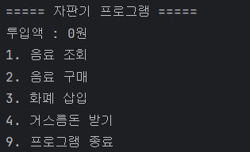
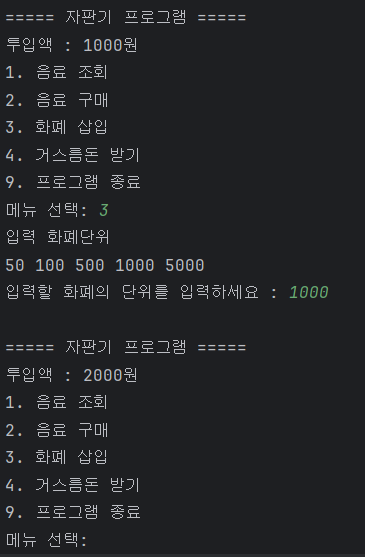
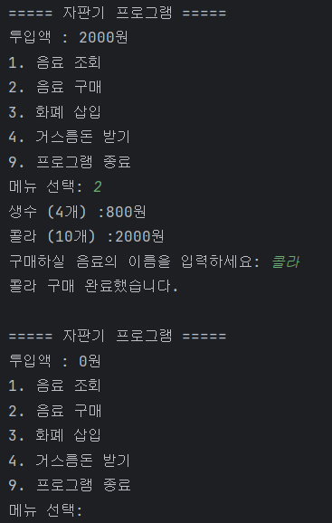
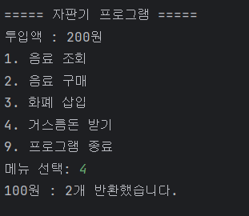
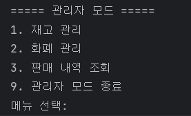
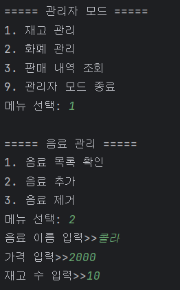
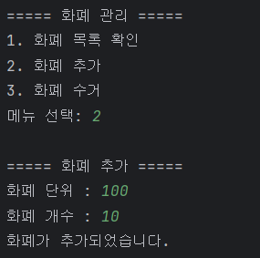
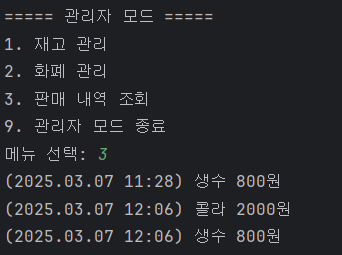
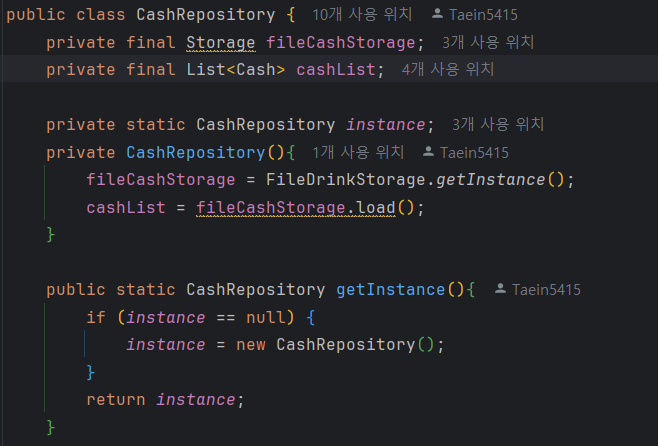
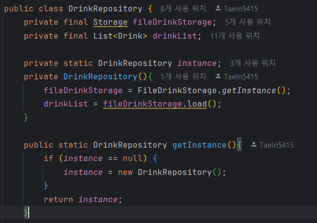

# 🥤자판기 프로그램

## 📌 소개
이 프로젝트는 Java로 구현한 자판기 시뮬레이션 프로그램입니다.  
사용자는 돈을 투입하고 원하는 음료를 선택하여 구매할 수 있으며, 거스름돈도 반환받을 수 있습니다.

## 🚀 기능
- 사용자는 돈을 투입하여 자판기에서 음료를 구매 가능, 거스름돈을 반환 가능하다.
- 관리자는 음료 종류 및 재고 관리, 화폐 관리. 판매 내역 조회를 할 수 있다.

## 🖼️실행 화면

    
사용자 화면

    

        
    

    
화폐 삽입

    

        
    

    
음료 구매

    

        
    

    
거스름돈 반환

    

        
    

    
관리자 화면

    

        
    

    
재고 추가

    

        
    

    
화폐 추가

    

        
    

    
판매 내역 조회

    

        
    

## ✨고려한 점
1. 기존에는 Applicatioin에서 ui를 출력했지만, 사용자 화면과 관리자 화면을 출력하는 화면의 역할이 다르므로 Application에서 ui역할을 분리하여 각각의 클래스에 역할을 분배했음
  

2. . UserCLI와 UserCLI 모두 Service를 통해 CashRepository와 DrinkRepository에서 데이터를 가져온다. 이때, 각각의 CLI에서 서로 다른 Repository에서 데이터를 읽고 쓰게 된다면 데이터의 무결성을 위반할 수 있으므로 Repository 클래스의 생성자에 싱글톤 패턴을 적용했다.

    
CashRepository 생성자

    

        
    

    
DrinkRepository 생성자

    

        
    

## 🥲 아쉬운점
+ 판매 내역 조회 기능을 더 세부화 하지 못했다. 
  

+ 테스트 코드 작성을 하지 못했다. 
  

+ git 컨벤션을 지키지 못했다.